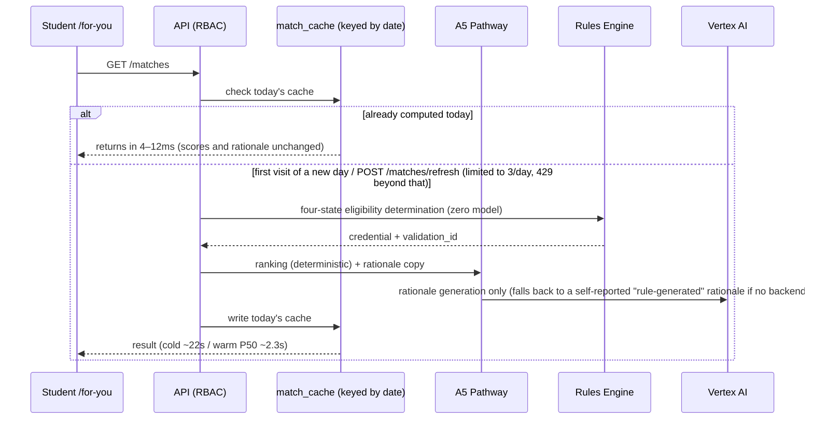

English edition of ARCHITECTURE.md, translated for the hackathon submission (2026). The Chinese original remains the maintained source in the private working repository.

# CampusPath Architecture Document

> Version alignment: Spec **v4.1.36** · Plan V2 · Contract **1.42.0** · Seed **1.12.0** (synced to `main` 2026-08-24)
>
> 2026-08-24 Observability + Agent registry (Spec v4.1.36, contract 1.41.0→1.42.0, Hackathon P4):
> **① Tracing** — `campuspath_agents.telemetry.span()` depends only on opentelemetry-api (no-op when no exporter is configured);
> instrumentation is added in four places: `VertexModel.generate/generate_grounded`
> (`gen_ai.*`: request model, response `model_version`, input/output/thinking tokens, purpose, thinking_level),
> `ToolBelt.call` (including calls blocked by the allow-list — `campuspath.tool.accepted=false` is also recorded),
> `run_repair_loop` (one child span per round: prior-round violation count, current-round violation count;
> the loop span records `outcome=valid|exhausted`), and `OrchestratorAgent.route`
> (`kind=deterministic_route`, `gen_ai.request.model=none` — "no model was called" is now visible too).
> Attributes are scalar-only and truncated to 200 characters; **raw prompt text never enters a trace**.
> The API layer's `campuspath_api.telemetry` decides the destination: `CAMPUSPATH_TRACE=gcp` → Cloud Trace
> (BatchSpanProcessor, non-blocking) / `console` / `memory`; each HTTP request produces one root span,
> with model/tool/repair-loop spans nested under it — in Cloud Trace, a single "draft a plan" call is one tree.
> **② Registry** `GET /v1/ops/agents` (`AgentRegistry`, institution role only): each of the six agents' runtime
> ownership, tool allow-list, deny-list, and write domain **is derived from the `contracts.agents` governance
> table** (tests reconcile it item-by-item, never hand-written) + `ModelBackendStatus` (default model, most
> recent response's `model_version`, generation floor, location, vertex_only) + `CheckpointStatus` (backend,
> save count, restore result, last error) + `TraceExportStatus` (exporter, spans exported, most recent 25 spans).
>
> 2026-08-24 State persistence (Spec v4.1.35, Hackathon P3): **the API's mutable state no longer resets to
> zero on cold start.** New data flow **Deps → checkpoint → Firestore**: `campuspath_api.persistence`
> maintains an **exhaustive** manifest (`MANIFEST` with 56 containers + `SKIPPED` with 19 justified
> exceptions; tests assert the two together cover every attribute of `Deps` — forgetting to register a new
> container turns the test red). A background thread runs every 10s, uses `campuspath_state.codec` to encode
> the manifest to JSON (type information travels with the data: Pydantic models, enums, dataclasses, dates,
> sets, tuple keys), writes a field-level diff summary (**only changed fields are written**), and commits it
> in one Firestore batch; on startup, `restore_from` performs one streaming query to read everything back —
> a **version stamp** (contract + Seed version) mismatch causes the restore to be rejected and falls back to
> a seed cold start. Three implementations share one protocol: `MemoryCheckpoint` (tests) / `FileCheckpoint`
> (local, temp file + atomic replace) / `FirestoreCheckpoint` (production, Cloud Run service-account ADC,
> **goes over REST** via `documents:commit` / `listDocuments` — the gRPC client, inside the container, encodes
> the routing header's `(default)` as `%28default%29` → 400; identical versions work fine locally, pinning the
> version does not fix it; the `_meta` document stores layout, and fields over 900 KB are chunked). **Decoding
> only trusts an allow-list**: type references are looked up in `Codec._types`, never resolved via dynamic
> import — a checkpoint is external input, and data must never be allowed to specify "which class to
> instantiate" (the zero-LLM fourth-layer scan caught a live `importlib.import_module` call; it only went
> green after being switched to an allow-list). The `validations` registry is also in the manifest: a
> restored PlanItem must still pass B8, and if its credential is missing it is rejected outright. **This
> solves durability, not multi-instance consistency** — background jobs and locks remain process-local, so
> the rationale for `max-instances=1` is unchanged. `CAMPUSPATH_CHECKPOINT` unset means disabled (the default
> for tests and local dev); production sets it to `firestore`.
>
> 2026-08-24 Model generation migration (Spec v4.1.34, generation-floor requirement
> "Gemini 3.5 or newer"): the semantic plane's single model exit point moved from `gemini-2.5-flash` to
> **`gemini-3.5-flash`**, and `campuspath_agents.model` gained a **generation floor**
> (`MIN_GEMINI_GENERATION=(3,5)`, checked at `VertexModel` construction time — same pattern as B12:
> the floor lives in the constructor, not in documentation). Both Agent Engine images were updated to 3.5
> in lockstep and **pin `location="global"`** in `client_kwargs` — in practice, 3.5-flash is only available
> on Vertex's `global` endpoint, `us-central1` returns 404, while the Agent Engine runtime itself still sits
> in `us-central1` (`GOOGLE_CLOUD_LOCATION` is now `global`; the Agent Engine probe path hardcodes its own
> region separately in `app.py`). The thinking parameter moved from 2.x's `thinking_budget=0` to 3.x's
> `thinking_level=MINIMAL` (grounded retrieval uses LOW): measured on 3.5-flash, `thinking_budget=0` took
> 20.9s for one call vs. 0.7s for MINIMAL. `VertexModel.last_model_version` records the `model_version`
> reported by the response — production verification that "3.5 is really running" relies on this field,
> not on assumption.
>
> 2026-08-10 Round 8 P4 (Spec v4.1.31, contract 1.39.0→1.40.0, Seed 1.10.0→1.11.0):
> **institution-side metrics moved from random numbers to real derivation.** Two new data flows:
> **① Exposure → tuple → aggregation → `/insights`**: the frontend's `lib/exposure.ts` uses an
> IntersectionObserver (threshold 0.5 + 300ms dwell) to record "actually entered the viewport" →
> `POST /students/{id}/exposures` (deduplicated by subject × entry point × depth × day) →
> `campuspath_state.exposure.ExposureStore` (**carries student_id, never leaves the domain**) →
> `campuspath_state.metrics.derive_metric_tuple` (**this function is the boundary itself**: it takes
> student_id in, and the `MetricTuple` that comes out does not even have that field) →
> `campuspath_aggregation` suppression and leaderboards → `/v1/insights/*`.
> **② Gap changes → `gaps_closed`**: `gap_map()` diffs against the previous snapshot on every call
> ("closed" = the requirement **disappears** from the gap list, because `gap_map` skips requirements
> that are already satisfied) → `GapChangeEvent` (a closure must carry evidence) →
> `GrowthTrajectory.gaps_closed` is no longer hardcoded to 0.
> Layering invariant: `campuspath_state` **must not import** `campuspath_agents` / `campuspath_rules`;
> eligibility and gaps are computed by the API orchestration layer and passed down as plain data
> (enforced by an AST assertion). Synthetic and derived rows carry `provenance` and are **never silently
> merged**; aggregation rows report `derived_cell_n`/`synthetic_cell_n`.
>
> 2026-08-10 Round 8 P3 (Spec v4.1.30, contract 1.38.0→1.39.0): **control** changed for two data flows.
> **① Profile upload → direct write + reversible**: `POST /students/{id}/resume` → `resume_template.py`
> deterministic parsing (zero model) → `_materialise_changes(origin=student_upload)` **writes directly**
> into experiences / interests / profile_extras, while also logging a `confirmed` proposal, a
> `ProfileChangeEvent(actor=student)`, and an `AppliedChange` ledger entry →
> `POST /profile/changes/{id}/undo` reverses each entry individually (only stamps `undone_at`, never
> deletes the row). The B3 boundary is enforced at the type level: the `ResumeUploadResult` validator
> rejects any source other than `student_upload`, so **A1 extraction/inference cannot use this channel**
> and must still land as pending proposals for the student to decide row by row.
> **② Planning → draft → approval → commit**: `GET /pathway` no longer generates on the fly (previously
> a read could trigger a write); it now only reads the adopted version. `POST /pathway/draft` runs A5
> (matches + memory advisory + carry-over), lays out a version, and stores it in `deps.pathway_drafts`;
> `POST /pathway/draft/{id}/decision?decision=adopt` writes to `deps.pathways` only after passing the B8
> gate. The model-free `build_demo_pathway` fallback is bound by the **same** gate. The frontend's
> `usePathwayPlan` + `PathwayApprovalGate` share one approval flow across both pages.
>
> 2026-08-10 Round 8 P2 (Spec v4.1.29, contract 1.36.0→1.38.0): expiry determination moved from
> "computed once at startup, deadline only" to **a single source of truth at read time**, `_is_expired`
> (deadline OR completed, union of both, clock = `deps.today`), shared by the plaza catalog and
> `_compute_matches` — **expired entries never enter any recommendation**; added `CurationBadge`, which
> exposes only a badge, never a score (auto-derived at ≥4.0 rating with ≥5 verifications; manual
> rationale is narrowed by a contract `Literal`). Seed 1.9.0→1.10.0: feedback now lands preferentially
> on live activities.
>
> 2026-08-04 North Star metric VGA shipped (Spec v4.1.23, contract 1.34.0): new data flow
> **reflection loop → VGA** — a reflection activity (OPP) → mints EV-REFL evidence and, in the same
> transaction, mints `ActionEvent(verified_growth=True, evidence_ids=(EV,))` (idempotent, enforced by a
> contract validator requiring attached evidence) → `GET /vga-summary` is a pure derivation, bucketed
> by month (0 is reported honestly with a 200) → the North Star card on the Growth Trajectory page
> (gold star + this month's count + cumulative + monthly bars + action list). Click/save/register
> events always have `verified_growth=false` (§17.1 "do not reward busyness").
>
> 2026-08-03 Self-declared term removal batch (Spec v4.1.20, contract 1.33.0): the channel for students
> to self-declare "what year I'm in now" was removed entirely — at the contract level,
> `ProfileSelfEdit.current_term` / `StudentProfile.current_term` / the `CurrentTerm` Literal were
> removed (structurally rejected via `extra=forbid`); the target-studio selector and the electives-page
> term dropdown were removed. The electives-page term view is now derived from the registrar side
> (year × registrar-code season → e.g. `Y2_FALL`); "All Requirements (by group)" is always present.
> The sole authority for term/year is now the registrar side (demo = seed manifest + institution-supplied
> year; real integration = SIS).
>
> 2026-08-03 Double-incident fix batch (Spec v4.1.19): **① A5 course term code has a single authoritative
> source** — `CoursePlanItem.term` always takes the registrar code from the seed manifest
> (`deps.current_term`, derived from the date if missing); `StudentProfile.current_term` is a "y1s2"
> grade-level code with the same name but a different meaning, and confusing the two once caused
> `GET /pathway` to 500 (`build_a5_pathway`'s call site now has an exception guard: any exception falls
> back to a fixture and is entered into that day's failure cache — read endpoints must never 500).
> **② near-two-weeks window has a single source of truth** — `apps/web/src/lib/plan-window.ts`
> (extracurricular items + earliest-activity anchor + 14-day window + `storedIntensity` sharing the
> same source), shared by the Action Center and the Extracurricular Planning page instead of each
> filtering independently. **③ Frontend session cache** — `useResource` gained `cacheKey` (a module-level
> Map, stale-while-revalidate: render on hit, silently revalidate in the background, never swallow
> errors); For You's three resources adopted it.
>
> 2026-08-03 Four new data flows: **① Passcode gate** (replacing the Google-email allow-list: middleware
> validates an HMAC httpOnly cookie; the passcode lives only in the `CAMPUSPATH_DEMO_PASSCODE` env var,
> and `/api/auth/passcode` issues it with a constant-time server-side comparison; page HTML is uniformly
> `no-store` — the old gate's 307 once masked Next's prerendered `s-maxage=1 year`, and removing the gate
> caused a white-screen incident); **② Agent Runtime status light** (a green top-bar light = billing is
> active: `GET /ops/agent-runtime` falls back to the Vertex REST API when the probe script fails
> [in-container ADC queries the ReasoningEngine list directly], cached with stale-while-revalidate and a
> single-flight background refresh); **③ three intensity tiers**
> (`GET /pathway?intensity=` → A5 tiers everything: courses 2/3/4, activity pool 8/10/12, near-two-weeks
> items ≤3/5/7, near-two-weeks budget 20/30/45h; the trigger fingerprint includes the tier);
> **④ "not participating"** (`DELETE /pathway/items/{id}`: version removal + a DECLINE audit event +
> the calendar's real block removed + a decline list preventing resurrection [filtered by both A5 and the
> demo fixture]). Also: the goal-change invalidation list was completed (research is marked stale by the
> goal name at the time it was launched; `set_goal` clears matches/electives day caches); Resume upload
> switched to deterministic template parsing (`resume_template.py`, zero model, the B3 proposal flow
> unchanged).
>
> 2026-08-02 Audit fix batch, new data flows: **Resume template parsing chain** (upload →
> `resume_template.py` deterministic section-by-section parsing [zero model] → pending proposal →
> materialized on confirmation: experiences carry a real type; education/language/honor go into extras;
> certificate goes into an EvidenceRecord); **A5 live generation chain** (GET /pathway → six-dimension
> matches + memory advisory → `a5_pathway.build_a5_pathway` [PathwayAgent repair loop + three course
> variants] → trigger=a5:<goal fingerprint>, falling back to a fixture on failure); **reflection feedback
> loop** (anonymous quality aggregation → sixth dimension; the student's own fit_tag → personal preference
> correction); **calendar-write recovery chain** (approved proposal ∩ no AB-plan block → Action Center
> persistent backfill area).
>
> 2026-08-02 Acceptance-feedback batch, new data flows: **planning → calendar projection** (the calendar
> page reads pathway's opportunity-type items + catalog start/end times → a dashed "planned" pseudo-block,
> replaced by a real block once approved and written); **⚠️ conflict persistence chain**
> (schedule-proposal computes conflicts server-side → non-blocking, still approvable → both the absorb
> step and the calendar write carry a ⚠️ prefix); **SourcesSweepJob** (a one-click sweep background
> thread sharing `_do_refresh_source` with per-source refresh); **official_answers.json** (a Q&A
> lookup table inside packs; `match_official_answer` does deterministic literal matching → plan-item
> assumptions carry an official link; the plaza policy card is a secondary fallback);
> **candidate_goal_share** (recommendation mix: matches are interleaved proportionally by prefix +
> elective weighting and reserved slots).
>
> 2026-08-02 International-student pipeline fix batch (audit `docs/intl-chain-audit-2026-08-02.md` →
> five broken links reconnected): two new **consumer flows** off the Pack evaluation envelope —
> `/matches` derives `MatchResult.intl_notes` per opportunity after scoring (a three-state opportunity
> field + envelope lead time aligned to that opportunity's start date, zero LLM); `GET /pathway` reads
> the envelope's prep actions/missing info/constraints and derives `PlanItem(kind=action)` at read time
> (credential genuinely issued by Rules via `issue_prep_item_validation`, aligned to the B8 subject;
> **injected at read time, never cached**, the same pattern as decomposition's `_augment_with_intl`
> column). Policy cards are classified into policy / intl_policy via the registry's `policy_audience`;
> a failed runtime probe honestly reports `unknown`.
>
> 2026-08-02 Three new blocks (proposals A/B/C):
> **① Source-ingestion loop** — `services/connector/` gained a source registry (92 sources, 84 real /
> 8 mock, honestly distinguished by `is_real_fetch`) + a shared fetcher (stdlib, cached + polite
> intervals) + sha256 change detection; `GET/POST /v1/ops/sources*` endpoints; a change to a source on
> HKUST's official-domain allow-list is extracted via A4 and goes **straight to Published**
> (third-party submissions still go through manual review); a change to a policy source produces an
> intl_policy reminder card; daily sweep via `jobs/sources_refresh.py` (a Cloud Run Job at
> `infra/sources_job.sh`, deployed alongside `main`).
> **② services/packs/** — a vendored International Student Context Pack evaluator (zero LLM, the 11th
> member of the llm-free scan list); the `campuspath_rules.context_pack` bridge issues a real
> `validation_id` (passes B8's three-layer check; a Pack's self-minted VAL-* is record-only); the
> profile page is the single opt-in entry point, and A3 decomposition / For You / Action Center all read
> from the global profile setting.
> **③ Job-role profile data layer** — `agents/campuspath_agents/pack_data/` (employment_roles.json +
> evidence_catalog.json, deterministically compiled from JD corpora by
> `seed/compile_employment_pack.py`, a single source of truth); A3 matches profiles by keyword against
> `target_name` (zero model); an unmatched target falls back to "live AI decomposition" as a server-side
> background job (three-stage deterministic progress, output tagged `origin=ai_live` at the type level,
> capped at twice a day).
>
> UI design system v2 (Claymorphism × Claude warm palette): tokens and gates documented in
> `docs/CampusPath_Design_Tokens_v2.0_Clay_2026-08-01.md`; Advisor booking now uses one-hour slots +
> registration CRUD (B9); published-opportunity management-side lifecycle endpoints
> PUT/DELETE /v1/catalog/opportunities/{id} (B10: edit/unpublish, unpublish is idempotent and leaves a
> record); submitter status self-check GET /v1/publisher/submissions (B13: a returned-for-revision state
> is visible to the submitter, and resubmission reuses the same id).
>
> Three-tier wellbeing intervention mechanism (R8-3, zero LLM across the whole chain): trigger (14-day
> warning / 28-day · self-reported fatigue · overload + decline-rate ≥5 → ISI + PSS-10) → tier 1
> automatic contact with a self-filled tutor (submitting the scale itself is the informed action) →
> tier 2 counseling-office booking (the sole source of time slots is what the wellbeing desk configures
> as working hours; a booking carries name/major/year/class/contact info, with major and year
> auto-filled server-side) → tier 3 emergency red button (twice per semester; a third use disables it
> for the semester, and the disabled-state response still includes the hotline).
>
> This document answers "what the system is made of, how a request flows, and where the boundaries sit."
> The product definition of record is `CampusPath_Complete_Product_Spec_V4.1_2026-07-28.md`; where this
> document and the code disagree, the code wins and this document must be corrected to match.
> **Maintenance rule**: whenever a feature/architecture change ships, the relevant section and diagram in
> this document must be updated in the same change (see CLAUDE.md, "Documentation Maintenance").

---

## 1. One-Sentence Architecture

**Two planes + contract-first**: 6 semantic agents (A0–A5, the only layer allowed to call a model, and
only via Vertex AI) and 9 deterministic services (zero LLM, rules and thresholds) each own their own
concerns; every data exchange between the two planes is shaped by a Pydantic model in `contracts/` —
**data the type system disallows physically cannot flow through**.

- Determination (eligibility, capacity, wellbeing signals) → deterministic services, reproducible and
  auditable;
- Semantics (rationale copy, extraction, ranking explanations, trade-offs) → agents, and **A5 is the
  only one that makes trade-offs**;
- The frontend splits into two portals (student / institution); the server-side RBAC role table is
  generated directly from the contract.

## 2. System Architecture Overview

```mermaid
flowchart TB
    subgraph Clients["Frontend (Next.js 16, bilingual i18n, the two portals cannot see each other)"]
        SP["Student Portal<br/>14 pages (profile/goals/gaps/planner/for-you/square/<br/>timeline+actions/calendar+wellbeing/reflections/memory…)"]
        IP["Institution Portal (one role per workstation, R7-A)<br/>publisher · console · review · plaza-admin ·<br/>insights · quality-reports · wellbeing-desk · advisor-desk"]
        PWA["Installable PWA<br/>manifest + appleWebApp + sw.js<br/>(HTML never cached)"]
        LG["/login synthetic login<br/>campuspath.session + three-rule guard"]
    end

    subgraph API["services/api — FastAPI assembly layer"]
        RBAC["RBAC middleware<br/>role table generated from the contract"]
        EP["Contract 1.10.0<br/>(all student/institution/system endpoints)"]
        GATE["B8 deployment gate<br/>PlanItem without validation_id ⇒ 422"]
    end

    subgraph AgentPlane["Semantic plane agents/ — Vertex AI only (B12 double enforcement)"]
        A0["A0 Orchestrator<br/>deterministic routing table + LLM fallback"]
        A1["A1 Student Context<br/>Resume/reflection extraction → always a pending proposal"]
        A2["A2 Academic<br/>facts and candidates only"]
        A3["A3 Goal-Gap<br/>decomposition Packs + fork points"]
        A4["A4 Opportunity<br/>tool allow-list of exactly 2"]
        A5["A5 Pathway<br/>the sole trade-off maker; every PlanItem carries a validation_id"]
    end

    subgraph DetPlane["Deterministic plane services/ — 9 modules, zero LLM (enforced by a three-layer scan)"]
        RUL["Rules & Constraint<br/>three-valued prerequisite logic · four-state eligibility · issues validation_id"]
        CAP["Capacity & Calendar<br/>five slot types · §16.6 capacity formula<br/>★ Calendar Token stops here"]
        WB["Wellbeing Composer<br/>five-signal thresholds + fixed bilingual templates<br/>two-reminder state machine"]
        STA["State & Memory<br/>four-layer memory · three-stage profile writes · lock/forget"]
        ACT["Action & Consent<br/>preview→receipt→idempotent execution→audit<br/>receipts issued server-side"]
        AGG["Aggregation<br/>k-anonymity suppression · time decay · no student_id"]
        MON["Event Monitor & Replan<br/>debouncing · AffectedScope (long-term items unaffected)"]
        PUB["Publishing / Review / Audit<br/>overreach blocked and logged as ScopeViolation"]
        CON["Connector & Catalog<br/>three-adapter interface · Source Health"]
    end

    subgraph Data["Data and external sources"]
        VX["Vertex AI · Gemini 3.5 Flash (global endpoint)<br/>the sole model exit point, on the grant-credit billing account; generation floor ≥3.5 checked at construction"]
        MDL["Moodle sandbox (GCE)<br/>mcp/moodle_mcp read-only allow-listed MCP"]
        CATALOG["HKUST real public data<br/>1534 courses in the catalog · Engage activities · 5 program requirement sets"]
        SEED["Synthetic Seed 1.12.0<br/>12 students · 205 opportunities · Gold Set"]
        FS["Firestore (default)<br/>checkpoint: MANIFEST, 56 fields<br/>writes only what changed · restored on cold start · gated by version stamp"]
        CT["Cloud Trace (OpenTelemetry)<br/>gen_ai.* model spans · tool spans<br/>repair loop per round · A0 routing"]
    end

    SP --> LG --> RBAC
    IP --> LG
    RBAC --> EP --> GATE
    EP --> A0
    A0 --> A1 & A2 & A3 & A4 & A5
    A1 -. "EventQualityFeedback only<br/>(enforced at the type level, raw text cannot pass)" .-> AGG
    A2 --> RUL
    A5 -- "every item must cite" --> RUL
    EP --> RUL & CAP & WB & STA & ACT & AGG & MON & PUB & CON
    A1 & A2 & A3 & A4 & A5 --> VX
    CAP -- "free/busy (tier 1) / titles (tier 2, authorized)" --> CON
    CON --> MDL & CATALOG
    EP --> SEED
    EP -. "persistence.Persister every 10s<br/>field-level diff · batch" .-> FS
    FS -. "restore_from (only restores on stamp match)" .-> EP
    A1 & A2 & A3 & A4 & A5 -. "span (scalar attributes only, no raw prompt text)" .-> CT
    A4 -. "external content is user-role data<br/>never enters the system prompt" .-> CON

    style CAP fill:#fff3e0,stroke:#e65100
    style WB fill:#fff3e0,stroke:#e65100
    style RUL fill:#fff3e0,stroke:#e65100
    style A5 fill:#e3f2fd,stroke:#1565c0
    style VX fill:#e8f5e9,stroke:#2e7d32
```



Orange = the three concrete modules behind the "zero LLM" invariant in the architecture's six rules;
blue = the sole trade-off agent; dashed lines = data channels forcibly narrowed by the type system.

## 3. Key Request Flows

### 3.1 Recommendations (For You, F11) — once-daily AI generation, rate-limited refresh



### 3.2 From Suggestion to Calendar Write (F06/F16) — the consent chain

```mermaid
sequenceDiagram
    participant S as Student
    participant A1 as A1 (extraction)
    participant ST as State & Memory
    participant AC as Action & Consent
    participant CAP as Capacity & Calendar

    S->>A1: reflection text / Resume (private_text never enters the model)
    A1->>ST: always a pending proposal (conflicting items marked update, carrying the old value)
    S->>ST: accept / reject each item
    S->>AC: approve the scheduling proposal
    AC-->>S: server-issued receipt RCPT-{proposal_id}
    S->>CAP: write to the CampusPath Plan calendar using the receipt
    Note over CAP: verifies the receipt's issuer/ownership/that the slot is within the preview<br/>forged or out-of-scope ⇒ 403; without calendar_write consent ⇒ 403 shown honestly
```

## 4. Six Architectural Invariants → Where They Are Enforced in Code

| # | Invariant (Spec §8.9) | Enforcement mechanism (code location) |
|---|---|---|
| 1 | A5 is the sole trade-off agent | `agents/campuspath_agents/roster.py`: A1–A4 output types have no ranking field; asserted by the eval suite's B-series checks |
| 2 | Wellbeing is zero-LLM end to end | `services/wellbeing/`: threshold determination + six-slot bilingual templates; enforced by a three-layer zero-LLM scan (runtime sys.modules / dependency tree / source-code import scan) |
| 3 | Calendar Token never enters an LLM context | The token stops at `services/capacity/`; the two authorization tiers release only **text** titles, never the credential, enforced at the type level by `AvailabilityBlock._title_requires_grant` (B5) |
| 4 | A4's tool allow-list has only 2 entries | `agents/campuspath_agents/tools.py`'s ToolBelt double-enforces this; external content travels in `ModelRequest`'s data field, physically separated from the system prompt |
| 5 | Every PlanItem carries a validation_id | Issued by Rules (shape check + Registry check, two layers); the API's B8 gate returns 422 if it's missing |
| 6 | A1 → Aggregation passes only structured feedback | `EventQualityFeedback` has no student_id field; Aggregation's public function signatures contain no student_id (a structural assertion) |

## 5. Layer Inventory

### Contract layer (`contracts/`, the single source of truth)
Declarative OpenAPI (`openapi.py`, not reverse-derived from FastAPI). **184 data contract types / 95 paths,
114 operations** (measured 2026-08-10), version **1.40.0**. Externally these are always called "data
contract types" — "model" in an AI-product context gets read as "large language model." Changes go
through a three-step process: declare in `openapi.py` → `make contracts && make types` → API
implementation. Frontend TS types are generated from the same source; `make contracts-check` guards
artifact consistency.

### Deterministic plane (`services/`, 9 modules + 2 assembly layers)
The 9 modules shown above are each independently packaged, independently tested, and each passes the
three-layer zero-LLM scan (`make llm-free`). There is also `services/api/` (FastAPI assembly + RBAC +
B8 gate) and `services/mock-campus/` (7 mock endpoints for SIS/Degree Audit, etc.).

### Semantic plane (`agents/`)
| Agent | Class | Responsibility |
|---|---|---|
| A0 | `OrchestratorAgent` | Two-stage routing: deterministic routing table + LLM orchestration fallback |
| A1 | `StudentContextAgent` | Resume/reflection extraction; output is always a pending proposal; private raw text never enters the model |
| A2 | `AcademicAgent` | Academic facts and candidates (unranked); Moodle adapter hook is wired in, backlogged |
| A3 | `GoalGapAgent` | Goal decomposition (`GOAL_DECOMPOSITION_PACKS`, three-cohort packs: job search / entrepreneurship / grad school) + dual-goal fork points |
| A4 | `OpportunityAgent` | Normalizes untrusted external content; allow-list of `read_source` + `emit_opportunity_draft` |
| A5 | `PathwayAgent` | Sole trade-off maker: ranking, Plan A/B/C, constraint repair loop, low-load trial runs |

Model access uniformly goes through `vertex.py` (ADC, `assert_vertex_only()` — a runtime self-check plus
a static-scan double safeguard). Tests use `ScriptedModel` (raises if a purpose wasn't pre-registered) —
agent correctness does not depend on being able to actually reach the model.

**Production depth (R7-D, all six classes live since 2026-08-01)**: A1 (Resume/reflection), A3
(decomposition/fork), A2 (candidate construction `_course_candidates_for`), A0 (deterministic routing for
/matches and elective recommendations, traceable via `GET /v1/students/{id}/agent-trace`), A4
(`POST /v1/ops/sources/ingest` ingestion chain, raw text used only as a data block); A5's role (sole
ranker) is exercised in /matches.

**Cloud deployment form (ADK → Vertex AI Agent Engine, us-central1)**: two runtimes,
`agents/cloud/orchestrator_agent` (A0's mirror, its routing table kept item-for-item consistent with the
roster by `test_cloud_mirror.py`) and `agents/cloud/opportunity_scout_agent` (A4's mirror, tool signature
has no publish channel). Managed via `bash infra/agent_engine.sh status|query|delete` — the runtime is
billed hourly, so **it must be deleted after every demo**.

### Data layer (`seed/` + `mcp/`)
- **Real public data**: the HKUST course catalog (58 subjects, 1534 courses, prerequisite expressions
  kept verbatim), 66 Engage activities, 5 program requirement sets
  (`seed/raw/hkust_programs/programs.json`, 37 groups);
- **Synthetic data** (Seed 1.5.0, byte-level reproducible): 12 students (3 deep personas), 143
  opportunities (eight publisher categories), Gold Set with 15 per state across four states, 16 failure
  sample classes; pages are labeled Synthetic / Demo Data;
- **Moodle sandbox**: GCE instance `campuspath-moodle` (asia-east2-a, nightly shutdown 23:00–09:00 HKT);
  `mcp/moodle_mcp/` = an allow-listed read-only `wsfunction` client + a stdio JSON-RPC MCP server + a
  contract-mapping adapter; the token lives only in Secret Manager.

### Frontend (`apps/web/`, Next.js 16 + bun)
Both portals share one app, isolated by `providers.tsx`'s session model and `nav.ts`'s portal filter
plus a three-rule guard (not logged in → /login; wrong portal → bounced back to that portal's home;
already logged in and hitting /login → bounced back). The real permission boundary is server-side RBAC.
All copy goes through `src/i18n/` (`en.ts` is the type source); Simplified/Traditional/English are all
switchable and persisted — the Traditional Chinese dictionary is generated from Simplified via OpenCC
(`i18n:hant` + `i18n:hant:check` guards consistency); the contract's `LocalizedText` adds no field —
dynamic server-side copy is deterministically converted at runtime in Traditional mode.

**Mobile and PWA (2026-08-11 P6)**: the student side's 14 pages are mobile-first; the institution
side's 8 pages are guaranteed usable. The shell switches to a bottom tab bar below 1024px (6 slots,
short labels via `mobileLabelKey`); `Drawer` becomes a bottom sheet; `/calendar` becomes a day/agenda
view — **what changes is the form factor, not just the size**. The installable PWA is built from three
pieces: `app/manifest.ts` (standalone + maskable icons), `layout.tsx`'s `appleWebApp` (iOS doesn't read
the manifest), and `public/sw.js`. The service worker's boundary is written as its own first rule:
**HTML is always network-only and never cached** (caching HTML would turn a single white-screen
incident into a permanent version the user can't clear), and only content-hashed `/_next/static/*` is
cached; there is no API offline cache (the backend is in-memory with a demo clock — stale data is worse
than no data). `/sw-unregister` and `?sw=off` are the uninstall back door — the service worker is the
one piece of the whole frontend that can permanently lock a user onto an old version. The manifest,
sw.js, and icons must sit **outside** the passcode gate (`middleware.ts`'s `PUBLIC_PATHS`), otherwise
they get 302'd to HTML and the install prompt simply disappears.

### Evaluation (`eval/`, `make eval`)
13 BLOCKER (invariants — any violation fails the suite) · 12 TARGET (quantitative metrics, currently
11/12, with T11 honestly reported red at 75%) · 5 BASELINE (control baselines, fully deterministic).
Judgment-type metrics require byte-identical results across repeated runs; the Gold Label set and the
scoring engine are deliberately implemented separately.

## 6. Cross-Cutting Mechanisms

- **Gate chain**: `scripts/preflight.sh` (14 checks, including an assertion that the billing account is
  the grant-credit account) → pre-commit secret/AI-Studio blocking → `make check` (preflight + contract/
  Seed consistency + full test suite + llm-free + harness self-check).
- **Harness Engineering**: a checker must prove it actually fails using a sample known to fail (H5);
  report measured values, not expected ones. The single source of truth for known pitfalls is Plan §10.2.
- **Context handoff**: `.claude/hooks/handoff.py` (70% reminder / 80% auto-compaction / auto-injects
  `HANDOFF.md` after compaction).

## 7. Document Map

| Document | Role |
|---|---|
| `CampusPath_Complete_Product_Spec_V4.1_2026-07-28.md` | Product baseline (currently v4.1.7, features F01–F27, zero deletions) |
| `CampusPath_Implementation_Plan_V2.md` | Execution plan: D1–D7 acceptance, WP0–WP11, pitfall ledger §10.2 |
| **This document** | Architecture: composition, data flow, boundary enforcement (updated in step with implementation) |
| `README.md` | Entry point: project overview + file structure + getting-started commands |
| `PROGRESS.md` | Progress audit: records only verified facts, with verification method and commit |
| `docs/demo-runbook.md` | Spec §19's seventeen-step demo checklist and rehearsal guide |
| `contracts/README.md` / `seed/DATA_DICTIONARY.md` / `infra/README.md` | Per-layer details |
