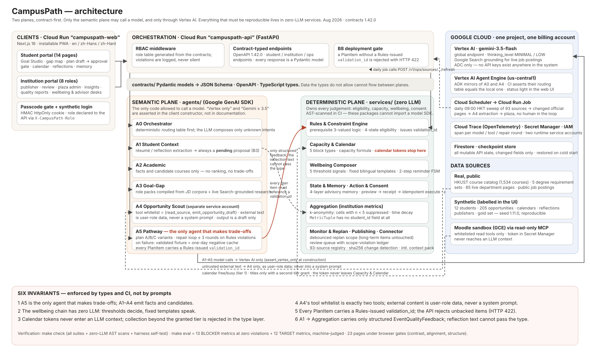

# CampusPath

**An agent fleet that turns "who I want to become" into a validated, calendar-aware growth plan — and keeps every step honest.**

Built for **Agents for Humans Hackathon** (AWS × Devpost, Sep 2026) · Track: **Everyday Agents**
Stack: **Strands Agents SDK** · **Amazon Bedrock (Nova Pro)** · **Bedrock AgentCore Runtime** · **Cloud Run** · **Firestore** · **OpenTelemetry**

> This is the public submission repository. The Chinese engineering ledgers (spec, plan, progress) are kept in the private working repository and are not part of the submission.

|                  |                                                                                                                                                                                                             |
| ---------------- | ----------------------------------------------------------------------------------------------------------------------------------------------------------------------------------------------------------- |
| Live demo        | https://campuspath-web-strands-786160486093.asia-east2.run.app/landing **【Demo passcode： `OceanMeetsTheSky!`】** (passcode is printed on `/landing`)                                                         |
| API (OpenAPI)    | https://campuspath-api-strands-786160486093.asia-east2.run.app/docs · agent registry: `GET /v1/ops/agents` (header `X-CampusPath-Role: career_center_admin`) reports `runtime=agentcore`, `backend=bedrock` |
| Architecture     | [`docs/hackathon/architecture.svg`](docs/hackathon/architecture.svg)                                                                                                                                        |
| Demo video       | ≤ 5:00; shot list in the Devpost write-up above. <!-- TODO(user): YouTube link once recorded -->                                                                                                            |
| Data             | **All student, calendar, opportunity and publisher data is synthetic.** Course catalog and degree requirements are scraped from HKUST's public catalog. UI shows a `Synthetic / Demo Data` badge.           |

> **Both portals need the demo passcode.** The landing page is the front door for judges: it explains the product in three languages and lists the two entrances — **Student** and **Institution (Career Center)**. Each entrance asks for the passcode printed on that page (`OceanMeetsTheSky!`). Without it the app shows only the login gate.

---

## 1. The friction

A university student asks a simple question — *"I want to be a data scientist; what do I do this semester?"* — and gets a fragmented answer: a degree-requirements PDF, a careers-office noticeboard, 90+ department web pages that change weekly, a calendar that is already full, and an advisor with a 3-week queue. Advice that ignores prerequisites, capacity or sleep is worse than no advice: it produces plans that get abandoned in week 3.

CampusPath takes over that loop end to end. It does not chat. It **proposes** a concrete plan (courses + activities + preparation actions), shows the evidence for every item, asks the student to approve or decline item by item, projects the approved items into the calendar, watches the environment in the background, and **adapts** from the student's own feedback — reflections, ratings, and refusals. That is the "everyday agent" this hackathon asks for: a repeated, unglamorous piece of personal admin (term planning), handled to completion, not narrated.

## 2. What the agents do

Every model call in this codebase is now a **Strands `Agent` invocation** — the request path (A0–A5) does not touch a model SDK directly. Two hooks (`agents/campuspath_agents/hooks.py`) are attached to every such `Agent` regardless of which one it is or which model backend is behind it:

- **`PromptHygieneHook`** (`BeforeModelCallEvent`) scans every outgoing message and the system prompt for credential-shaped text (`ya29.…`, `Bearer …`, `calendar_token`, `access_token`, `refresh_token`) and raises before the request leaves the process if it finds one.
- **`ToolWhitelistHook`** (`BeforeToolCallEvent`) looks up `contracts.agents.AGENT_TOOL_WHITELIST` for the calling agent and cancels (`event.cancel_tool`) anything not on it, logging the rejection to the agent's `ToolBelt` and to the trace.

| Agent | Role | Strands construct | Hard constraint (enforced in the type layer, not in prompts) |
|---|---|---|---|
| **A0 Orchestrator** | Routes an intent to the agents it needs | Deterministic routing table first (zero model calls — the main source of the sub-3 s P50 latency target); an unmatched intent falls back to one Strands `Agent` call (`compose()`) — trace tells the two paths apart | Known intents never touch a model at all |
| **A1 Student Context** | Extracts facts from résumé / reflections | `Agent.structured_output_async(EventQualityFeedback)` — the model returns a typed Pydantic object directly, no hand-rolled `id\tzh\ten` parsing | Output is **always a pending proposal**; nothing is written until the student confirms (B3) |
| **A2 Academic** | Facts and candidate courses | Plain `Agent` call under the same two hooks; no structured trade-off object in its output type | Emits facts only — no ranking, no trade-offs |
| **A3 Goal-Gap** | Decomposes a target role into requirements, finds the gap | `Agent` call, plus live Google-Search-grounded research when the Vertex backend is active and no compiled role pack matches | Uses compiled role packs (from real JD corpora) first; live research only for unmatched roles |
| **A4 Opportunity Scout** | Extracts opportunity drafts from **untrusted** external pages | The only agent with real tools: `ToolBelt.as_strands_tools()` wraps exactly two functions (`read_source`, `emit_opportunity_draft`) as Strands `PythonAgentTool`s; `ToolWhitelistHook` cancels anything else the model tries to call | External text is user-role data and never enters a system prompt; output can only be a *draft*; runs under a separate service account with zero student-data permissions |
| **A5 Pathway** | The **only** agent allowed to make trade-offs | `run_parallel_variants` (Plan A/B/C) and `run_repair_loop` (≤ 3 rounds) both drive `Agent.structured_output_async(PathwayDraft)`; the repair-loop invariant is that every round re-validates the draft against the Rules engine before it is accepted, and violations are fed back to the next round as a user message | Every `PlanItem` must carry a `validation_id` issued by the zero-LLM Rules engine, or the API rejects it (B8); on repair failure it falls back to a validated fixture and negative-caches the goal for the day |

Nine **deterministic services** (zero LLM, AST-scanned in CI) own everything that must be reproducible: prerequisite logic and eligibility, calendar capacity, wellbeing thresholds and templates, consent/receipts, k-anonymous aggregation for the institution, event monitoring/replan scope, publishing review, and source connectors. **Calendar tokens never reach any LLM context**; the institution dashboard cannot re-identify a student (cells with n < 5 are suppressed); private reflections cannot physically flow to the institution (the boundary is a Pydantic type, not a policy). None of this changed when the request path moved to Strands — the six invariants are the same six invariants, now enforced by hooks instead of hand-written guard code (see §3).

## 3. Why Strands here is non-obvious

It would be easy to swap `google.genai.generate_content(...)` for `Agent(...)()` and call it a port. What actually makes this "genuine, non-obvious use of Strands" (the hackathon's Creativity & Originality criterion) is that the SDK's **hooks** are used to enforce architecture rules a prompt cannot enforce, and the guards are demonstrated with known-failing samples rather than asserted in prose:

- **Whitelist cancel, not a polite refusal.** `ToolWhitelistHook._before` calls `assert_tool_allowed(agent, tool_name)` on every `BeforeToolCallEvent` and sets `event.cancel_tool` when it fails — the tool call never executes, the model receives a rejection string instead of a result, and the rejection is recorded on the `ToolBelt`'s audit log *and* as a trace attribute. Removing this cancellation (letting the tool call through) is one of the guard's known-failing samples: it turns red immediately.
- **Credential-shape scan, not a "don't leak tokens" instruction.** `PromptHygieneHook._before` runs on every `BeforeModelCallEvent`, regardless of agent or backend, and JSON-dumps the full message list plus the system prompt to scan for `ya29.`, `Bearer …`, `calendar_token`, `access_token`, `refresh_token` shapes. A hit raises `CredentialLeakBlocked` before the request leaves the process — the call fails outright rather than "probably" omitting the token.
- **`validation_id` gate, enforced twice.** A5's `structured_output_async(PathwayDraft)` output type requires the field at the Pydantic layer, and the API's B8 gate independently rejects any `PlanItem` without a `validation_id` the Rules engine actually issued — a plan item without a validation credential is not a plan item, and the model cannot talk its way around either check.

All three are backend-agnostic: the same hooks run whether the underlying `Model` is `ScriptedStrandsModel` (the zero-cost CI stub), `BedrockModel` (Nova Pro), or `GeminiModel` (Vertex AI). That is what lets CI prove the guards fire without a cloud credential in sight, and it is also why a thin SDK swap would not have been enough — a hook only earns its keep if removing it turns a specific, named test red.

## 4. Architecture



Two planes, contract-first: the **semantic plane** (A0–A5, the only code allowed to call a model, exclusively through Strands `Agent` calls) and the **deterministic plane** (nine services, zero LLM). Every exchange between them is a Pydantic model in [`contracts/`](contracts/README.md) (the single source of truth: JSON Schema + OpenAPI + generated TypeScript types). Data the types don't allow physically cannot flow.

**Agent registry (live):** `GET /v1/ops/agents` (institution roles) — the six agents with their runtime, tool whitelist, forbidden patterns and write domains, **derived from the contract governance tables, not hand-written** (a test asserts equality), plus `ModelBackendStatus` (`runtime: "strands"`, `backend: bedrock|vertex|scripted`, `sdk_version` read from `importlib.metadata` — not copied from documentation, last observed `model_version`, `tool_rejections_last_call`), checkpoint status, and trace status.

| Service | Provider | Role |
|---|---|---|
| Strands Agents SDK | — | The single channel for every model call: `Agent` + hooks + `ToolBelt`-wrapped tools + `structured_output_async` |
| Amazon Bedrock — Nova Pro (`amazon.nova-pro-v1:0`) | AWS | Default model backend (`CAMPUSPATH_MODEL_BACKEND=bedrock`); **in-region** model ID, `us-east-1` — free-plan AWS accounts reject cross-region (`us.*`) inference profile IDs |
| Bedrock AgentCore Runtime | AWS | Target deployment for the semantic plane (entrypoint `agents/cloud/agentcore_app.py`, whitelist-routes `{"A0": orchestrator_agent, "A4": scout_agent}`); see §6 for current deployment status |
| Gemini on Vertex AI | GCP | Retained alternative backend (`CAMPUSPATH_MODEL_BACKEND=vertex`); generation floor (≥ 3.5) and "Vertex only, never AI Studio billing" are both asserted at model construction, not documented as a convention |
| Cloud Run | GCP | `campuspath-api` (FastAPI) and `campuspath-web` (Next.js 16, PWA) |
| Firestore | GCP | Checkpoint store for all mutable API state (profiles, proposals, plans, drafts, memory, reflections…), restored on cold start |
| OpenTelemetry | — | Strands emits `invoke_agent` / `execute_tool` spans that nest under the HTTP request span; exported to Cloud Trace (GCP backend) or CloudWatch (AWS backend) depending on where the service runs |

The nine deterministic services and the contract-first architecture did not change in this port — see the Chinese `ARCHITECTURE.md` below for the full data-flow diagrams.

## 5. Run locally (≈ 10 minutes)

Prerequisites: Python 3.12, [`uv`](https://docs.astral.sh/uv/), [`bun`](https://bun.sh), bash ≥ 3.2 (macOS stock bash works). For the Bedrock backend (default) you need AWS credentials (`aws configure` or an SSO profile) with Bedrock access in `us-east-1`; for the Vertex backend you need a Google Cloud project with the Vertex AI API enabled and `gcloud auth application-default login`.

```bash
git clone <this repo> campuspath && cd campuspath
cp .env.example .env              # edit AWS_PROFILE / AWS_REGION / BEDROCK_MODEL_ID, or GOOGLE_CLOUD_PROJECT for Vertex

bash scripts/install-hooks.sh     # pre-commit: secret hygiene + AI-Studio-denylist guard
make setup                        # uv venv + installs every package in editable mode
bash scripts/preflight.sh         # billing / secrets / backend checks — must end with the green "ready" line
make smoke                        # < 10 s: contracts + seed + core services

CAMPUSPATH_MODEL_BACKEND=bedrock AWS_PROFILE=<your-aws-profile> make api   # FastAPI on :8000
cd apps/web && bun install && cd ../..
make web                          # Next.js on :3100
```

Open http://127.0.0.1:3100 → **Login** (synthetic personas: students `STU-A` … `STU-L`, plus institution roles). Language switch (EN / 简 / 繁) is in the top bar. Without model credentials the app still runs end-to-end on deterministic fixtures; only model-backed endpoints return 503.

Full verification: `make check` (all suites + zero-LLM AST scans + harness self-test).

## 6. Deploy

**Bedrock AgentCore Runtime** (the AWS-native deployment target for the semantic plane):

```bash
# stage: rsync contracts/agents/services into infra/agentcore/app/campuspath/ (CodeZip
# build input, gitignored) and run a real self-test call against the staged copy
make agentcore-stage

# deploy: prints (does not run) the two commands below — deploying spends real money
make agentcore-deploy
cd infra/agentcore && AWS_PROFILE=<your-aws-profile> AWS_REGION=us-east-1 agentcore deploy --dry-run
cd infra/agentcore && AWS_PROFILE=<your-aws-profile> AWS_REGION=us-east-1 agentcore deploy
```

Then point the API at the deployed runtime (without `AGENTCORE_RUNTIME_ARN` the model-backed endpoints stay
503 — they do not silently fall back to a local Bedrock call):

```bash
CAMPUSPATH_MODEL_BACKEND=bedrock CAMPUSPATH_AGENT_RUNTIME=agentcore \
  AGENTCORE_RUNTIME_ARN=<runtime-arn-from-agentcore-deploy> \
  make api
```

Deployed 2026-09-12 with `agentcore deploy --yes` (CDK bootstrap + CodeZip remote build; no local Docker needed). The runtime reports `READY`; `agentcore invoke` and the API's remote client both round-trip through Amazon Bedrock Nova Pro. Warm invocations take under a second; the first invocation of a new session takes ~10 s (microVM start).

**Cloud Run** (FastAPI + Next.js):

```bash
# One script does secrets → API → web → status (dry run: DRY_RUN=1). It refuses to touch any other service name.
AWS_PROFILE=campuspath AGENTCORE_RUNTIME_ARN=<runtime-arn-from-agentcore-deploy> make deploy-strands
```

The API container gets `CAMPUSPATH_MODEL_BACKEND=bedrock`, `CAMPUSPATH_AGENT_RUNTIME=agentcore`, the runtime ARN, `AWS_REGION=us-east-1`, `CAMPUSPATH_CHECKPOINT=firestore:strands` (its own Firestore collection), `CAMPUSPATH_TRACE=gcp`, and the AWS access key pair from Secret Manager. The web container only needs the API origin. Region asia-east2, `--max-instances 1` (the checkpoint writer is process-local).

## 7. Verification & honesty

`make check` runs: contract/seed consistency checks, all test suites (`agents`, `api`, `contracts`, plus every deterministic service), the zero-LLM AST scans (now also denying `strands`, `strands_tools` and `bedrock_agentcore` imports in the deterministic packages, and `bedrock-runtime.` hosts in the network-boundary scan), and a harness self-test that verifies `make` itself exits non-zero on a failing suite.

Every guard is proven with a **known-failing sample**, not asserted in prose — reproducing three of them:

- Cutting `ToolWhitelistHook`'s cancellation (letting a non-whitelisted tool call actually execute) → 1 known-failing test turns red.
- Removing `assert_vertex_only` from the Vertex model-build path → the Vertex agent now constructs even with a bare API-key client → 1 known-failing test turns red.
- Reverting `agents/cloud/*` to the pre-Strands ADK mirrors → 4 known-failing tests turn red (the cloud-mirror test asserts the Strands roster's tool whitelist and routing table match the local one byte-for-byte).

Plus three narrower probes added alongside the guard suite: the zero-LLM scan rejecting a `strands` import inside a deterministic service, `check_ai_studio` rejecting `GeminiModel(client_args={"api_key": …})` (the AI-Studio-billing shape) with the same severity as a bare `GOOGLE_API_KEY`, and `preflight.sh`'s `[7/7] AWS model backend` check.

## 8. Data notice

All student, calendar, opportunity and publisher data in this system is **synthetic**; the UI marks every such page `Synthetic / Demo Data`. The HKUST course catalog and degree requirements are scraped from HKUST's public catalog (no student data) with a polite crawl interval and a disk cache.

---
